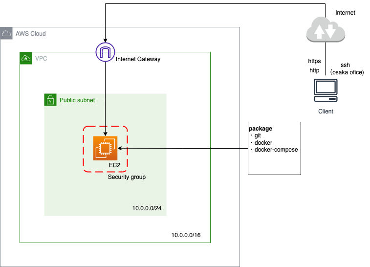

# CloudFormationで開発用webサーバー環境構築
CloudFormationを使って開発用のwebサーバー構築をコード化したので共有します。

## CloudFormationとは？
AWSリソースの環境構築を設定ファイルを元に自動化できるサービス
クロスリージョン、クロスアカウントで管理できる。

## ユースケース
- AWSリソース構築を効率化したい
- 開発・検証・本番環境で利用するインフラを標準化したい
- 毎回同じリソースやプロビジョニング設定を正確に利用したい
- ソフトウェアと同じように環境構成を管理したい

## 構成要素
- テンプレート
JSON/YAMLでリソースとパラメータを定義
- CloudFormation
スタックの作成・変更・削除、エラー検知とロールバック、リソース間依存環境を自動判定
- スタック
AWSリソースの集合体。スタック単位で管理可能でスタックを削除すると紐づいたリソースも削除される。

## 今回の構成


やっていないこと
- マルチAZ構成（社内アクセスのみのため）
- DB（本番のスナップショットから作成する運用のため）
- https化
- ドメイン設定
- 証明書発行

## コード
```
AWSTemplateFormatVersion: '2010-09-09'
Description: Create web server minimum environment.

Metadata:
  AWS::CloudFormation::Interface:
    ParameterGroups:
      -
        Label:
          default: Common Configuration
        Parameters:
          - EnvType
          - SystemName
      -
        Label:
          default: VPC Configuration
        Parameters:
          - VpcCIDR
      -
        Label:
          default: Subnet Configuration
        Parameters:
          - SubnetCIDR
      -
        Label:
          default: EC2 Configuration
        Parameters:
          - EC2KeyName
          - AllowedSshIp

Parameters:
  EnvType:
    Description: Please select Environment Type.
    Type: String
    Default: dev
    AllowedValues:
      - dev
      - stg
      - prod
  SystemName:
    Description: Please type the SystemName.
    Type: String
    Default: keiba-gc
  VpcCIDR:
    Description: Please type the VPC CIDR.
    Type: String
    Default: 10.0.0.0/16
  SubnetCIDR:
    Description: Please type the Subnet CIDR.
    Type: String
    Default: 10.0.0.0/24
  EC2KeyName:
    Description: Please select KeyPair.
    Type: AWS::EC2::KeyPair::KeyName
  AllowedSshIp:
    Description: Please type the ssh connection allowed IP
    Type: String

Resources:
  VPC:
    Type: AWS::EC2::VPC
    Properties:
      CidrBlock: !Ref VpcCIDR
      EnableDnsHostnames: true
      Tags:
        - Key: Name
          Value: !Sub ${EnvType}-${SystemName}-vpc
  InternetGateway:
    Type: AWS::EC2::InternetGateway
  AttachGateway:
    Type: AWS::EC2::VPCGatewayAttachment
    Properties:
      VpcId: !Ref VPC
      InternetGatewayId: !Ref InternetGateway
  RouteTable:
    Type: AWS::EC2::RouteTable
    Properties:
      VpcId: !Ref VPC
      Tags:
        - Key: Name
          Value: !Sub ${EnvType}-${SystemName}-rt
  PublicRoute:
    Type: AWS::EC2::Route
    Properties:
      RouteTableId: !Ref RouteTable
      DestinationCidrBlock: 0.0.0.0/0
      GatewayId: !Ref InternetGateway
  PublicSubnet:
    Type: AWS::EC2::Subnet
    Properties:
      AvailabilityZone: ap-northeast-1a
      CidrBlock: !Ref SubnetCIDR
      VpcId: !Ref VPC
      Tags:
        - Key: Name
          Value: !Sub ${EnvType}-${SystemName}-pub-sub-1a
  RouteTableAssocPublicSubnet:
    Type: AWS::EC2::SubnetRouteTableAssociation
    Properties:
      SubnetId: !Ref PublicSubnet
      RouteTableId: !Ref RouteTable
  WebServerSecurityGroup:
    Type: AWS::EC2::SecurityGroup
    Properties:
      GroupDescription: !Sub ${EnvType}-${SystemName}-sg
      VpcId: !Ref VPC
      SecurityGroupIngress:
        - IpProtocol: tcp
          FromPort: 443
          ToPort: 443
          CidrIp: 0.0.0.0/0
        - IpProtocol: tcp
          FromPort: 80
          ToPort: 80
          CidrIp: 0.0.0.0/0
        - IpProtocol: tcp
          FromPort: 22
          ToPort: 22
          CidrIp: !Ref AllowedSshIp
      Tags:
        - Key: Name
          Value: !Sub ${EnvType}-${SystemName}-sg
  WebServer:
    Type: AWS::EC2::Instance
    Properties:
      AvailabilityZone: ap-northeast-1a
      ImageId: ami-004332b441f90509b
      KeyName: !Ref EC2KeyName
      InstanceType: t4g.small
      SecurityGroupIds:
        - !Ref WebServerSecurityGroup
      SubnetId: !Ref PublicSubnet
      BlockDeviceMappings:
        -
          DeviceName: /dev/xvda
          Ebs:
            VolumeType: gp2
            VolumeSize: 64
      UserData:
        Fn::Base64: |
          #!/bin/bash
          sudo yum update -y
          sudo yum install -y git
          sudo yum install -y docker
          sudo systemctl start docker
          sudo systemctl enable docker
          sudo usermod -a -G docker ec2-user
          sudo mkdir -p /usr/local/lib/docker/cli-plugins
          VER=2.5.1
          sudo curl \
            -L https://github.com/docker/compose/releases/download/v${VER}/docker-compose-$(uname -s)-$(uname -m) \
            -o /usr/local/lib/docker/cli-plugins/docker-compose
          sudo chmod +x /usr/local/lib/docker/cli-plugins/docker-compose
          sudo ln -s /usr/local/lib/docker/cli-plugins/docker-compose /usr/bin/docker-compose
      Tags:
        - Key: Name
          Value: !Sub ${EnvType}-${SystemName}
  ElasticIP:
    Type: AWS::EC2::EIP
    Properties:
      InstanceId: !Ref WebServer
      Tags:
        - Key: Name
          Value: !Sub ${EnvType}-${SystemName}
```


## 今後やりたいこと
https化、ドメイン設定、証明書発行部分もコード化する。

