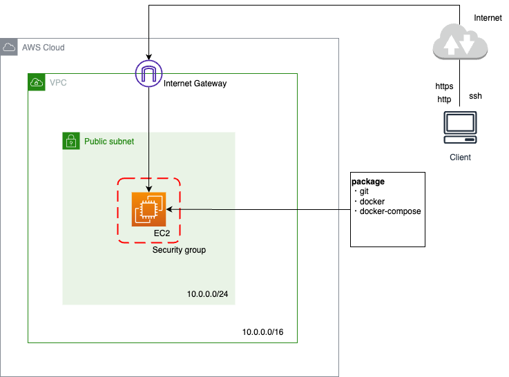
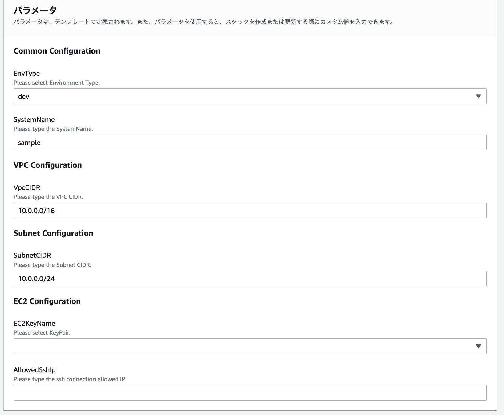

# AWS CloudFormationでサーバー環境の構築
## はじめに
AWSでサーバーを構築する方法として、まず挙げられるのは管理画面で操作する方法だと思います。1回しか使わない環境であればこの方法で十分ですが、複数のサービスを運用している場合は、開発環境などで汎用的な構成を使い回すことがあると思います。その場合、都度、管理画面で構築するのは手間がかかると思います。

そこで今回はAWS CloudFormationを使ってサーバー環境構築をコード化して管理する方法を紹介します。

## CloudFormationとは？
そもそもCloudFormationとは、AWSリソースの環境構築を設定ファイルを元に自動化できるサービスです。
クロスリージョン、クロスアカウントで管理が可能です。
IaC（Infrastructure as Code）の一つです。

## ユースケース
CloudFormationのユースケースとしては以下が挙げられると思います。
- AWSリソース構築を効率化したい
- 開発・検証・本番環境で利用するインフラを標準化したい
- ソフトウェアと同じように環境構成を管理したい

## 構成要素
- テンプレート
JSON/YAMLでリソースやパラメータの定義をするファイル
- スタック
テンプレートによって作成されたリソースの集合体。
スタック単位で管理可能でスタックを削除すると紐づいたリソースも削除される。

## 今回の構成
今回はEC2インスタンスを用いた以下の簡単なサーバー環境をコード化します。
- インターネットからhttp/httpsアクセスを許可
- ユーザーのクライアントからのssh接続の許可
- インスタンスにはgit、docker、docker-composeをインストール

このインスタンスにはdocker管理のアプリケーションをgitでcloneした開発環境として運用する想定です。個人/社内アクセスを想定しているため、マルチAZ構成にはしていません。



## 実装コード
今回の構成をコード化します。（yaml形式）

まずは、テンプレートのバージョンを記載します。
これは決まり文句みたいなものです。
```
AWSTemplateFormatVersion: '2010-09-09'
```
次にテンプレートの説明文を記載します。
```
Description: Create server environment.
```
テンプレートに追加するメタ情報を記載します。
今回はユーザー入力用のParametersの共通設定、VPC設定、Subnet設定、EC2設定をそれぞれグループ化する設定をmeta情報に書いています。
```
Metadata:
  AWS::CloudFormation::Interface:
    ParameterGroups:
      -
        Label:
          default: Common Configuration
        Parameters:
          - EnvType
          - SystemName
      -
        Label:
          default: VPC Configuration
        Parameters:
          - VpcCIDR
      -
        Label:
          default: Subnet Configuration
        Parameters:
          - SubnetCIDR
      -
        Label:
          default: EC2 Configuration
        Parameters:
          - EC2KeyName
          - AllowedSshIp
```
実行時にユーザーに入力を求めるパラメータを定義します。
今回は環境名とシステム名、VPC、SubnetのCIDR、EC2のKeyPair、SSH接続で許可するIPアドレスをユーザー入力できるようにします。環境名+システム名+リソース名で各リソースにつけるタグ名をつける想定です。
```
Parameters:
  EnvType:
    Description: Please select Environment Type.
    Type: String
    Default: dev
    AllowedValues:
      - dev
      - stg
      - prod
  SystemName:
    Description: Please type the SystemName.
    Type: String
    Default: sample
  VpcCIDR:
    Description: Please type the VPC CIDR.
    Type: String
    Default: 10.0.0.0/16
  SubnetCIDR:
    Description: Please type the Subnet CIDR.
    Type: String
    Default: 10.0.0.0/24
  EC2KeyName:
    Description: Please select KeyPair.
    Type: AWS::EC2::KeyPair::KeyName
  AllowedSshIp:
    Description: Please type the ssh connection allowed IP
    Type: String
```
※ AllowedValuesはセレクトボックスが表示されます。
※ Type: AWS::EC2::KeyPair::KeyNameは作成済みのKeyPairが呼び出されます。

上記のmeta情報とパラメータを定義すると、テンプレート作成画面で以下のような入力フォームが現れます。



作成するリソースを定義していきます。
Resourcesを定義して、配下に作成するリソースの論理名を記載し、その配下にリソースの設定を記述していきます。論理名は他のリソース作成時に呼び出せる名前で任意でつけられます。
```
Resources:
```

VPCを作成します。
CidrBlockはユーザー入力参照、TagsのValueはユーザー入力のEnvTypeとSystemNameをもとに決定します。
```
  VPC:
    Type: AWS::EC2::VPC
    Properties:
      CidrBlock: !Ref VpcCIDR
      EnableDnsHostnames: true
      Tags:
        - Key: Name
          Value: !Sub ${EnvType}-${SystemName}-vpc
```
インターネットゲートウェイを作成し、前述で作成したVPCにアタッチします。
```
  InternetGateway:
    Type: AWS::EC2::InternetGateway
  AttachGateway:
    Type: AWS::EC2::VPCGatewayAttachment
    Properties:
      VpcId: !Ref VPC
      InternetGatewayId: !Ref InternetGateway
```
パブリックルートを設定します。
まずはルートテーブルを作成します。VPCは前述で作成したものを参照し、TagsのValueはユーザー入力より設定されます。次に、作成したルートテーブルに前述で作成したインターネットゲートウェイをアタッチし、パブリックルートを作ります。最後にサブネットを作成し、パブリックなルートテーブルに関連づけます。サブネットのCIDRはユーザー入力で決定します。
```
  RouteTable:
    Type: AWS::EC2::RouteTable
    Properties:
      VpcId: !Ref VPC
      Tags:
        - Key: Name
          Value: !Sub ${EnvType}-${SystemName}-rt
  PublicRoute:
    Type: AWS::EC2::Route
    Properties:
      RouteTableId: !Ref RouteTable
      DestinationCidrBlock: 0.0.0.0/0
      GatewayId: !Ref InternetGateway
  PublicSubnet:
    Type: AWS::EC2::Subnet
    Properties:
      AvailabilityZone: ap-northeast-1a
      CidrBlock: !Ref SubnetCIDR
      VpcId: !Ref VPC
      Tags:
        - Key: Name
          Value: !Sub ${EnvType}-${SystemName}-pub-sub-1a
  RouteTableAssocPublicSubnet:
    Type: AWS::EC2::SubnetRouteTableAssociation
    Properties:
      SubnetId: !Ref PublicSubnet
      RouteTableId: !Ref RouteTable
```
EC2インスタンスに設定するセキュリティグループを作成します。
VPCは前述で作成したものを参照し、http/httpsのフルオープンで、sshはユーザー入力で指定したIP（オフィスor自宅）のみ接続できるようにします。
GroupDescriptionは必須パラメータであり、今回はTagsのValueと同様のものを設定します。

```
  ServerSecurityGroup:
    Type: AWS::EC2::SecurityGroup
    Properties:
      GroupDescription: !Sub ${EnvType}-${SystemName}-sg
      VpcId: !Ref VPC
      SecurityGroupIngress:
        - IpProtocol: tcp
          FromPort: 443
          ToPort: 443
          CidrIp: 0.0.0.0/0
        - IpProtocol: tcp
          FromPort: 80
          ToPort: 80
          CidrIp: 0.0.0.0/0
        - IpProtocol: tcp
          FromPort: 22
          ToPort: 22
          CidrIp: !Ref AllowedSshIp
      Tags:
        - Key: Name
          Value: !Sub ${EnvType}-${SystemName}-sg
```
EC2インスタンス（サーバー）を作成します。
今回はAmazonLinuxのarmアーキテクチャのt4g.smallを使います。開発用を想定しているので最小構成です。セキュリティグループ、サブネットは前述で作成したものを参照し、鍵ファイルはユーザー入力時に選択したものを使います。また、ユーザーデータプロパティでgit、docker、docker-composeをインストールするシェルスクリプトを記述します。これを記述することでgit、docker、docker-composeがインストールされた状態でEC2インスタンスが立ち上がります。
```  
  Server:
    Type: AWS::EC2::Instance
    Properties:
      AvailabilityZone: ap-northeast-1a
      ImageId: ami-004332b441f90509b
      KeyName: !Ref EC2KeyName
      InstanceType: t4g.small
      SecurityGroupIds:
        - !Ref ServerSecurityGroup
      SubnetId: !Ref PublicSubnet
      BlockDeviceMappings:
        -
          DeviceName: /dev/xvda
          Ebs:
            VolumeType: gp2
            VolumeSize: 64
      UserData:
        Fn::Base64: |
          #!/bin/bash
          sudo yum update -y
          sudo yum install -y git
          sudo yum install -y docker
          sudo systemctl start docker
          sudo systemctl enable docker
          sudo usermod -a -G docker ec2-user
          sudo mkdir -p /usr/local/lib/docker/cli-plugins
          VER=2.5.1
          sudo curl \
            -L https://github.com/docker/compose/releases/download/v${VER}/docker-compose-$(uname -s)-$(uname -m) \
            -o /usr/local/lib/docker/cli-plugins/docker-compose
          sudo chmod +x /usr/local/lib/docker/cli-plugins/docker-compose
          sudo ln -s /usr/local/lib/docker/cli-plugins/docker-compose /usr/bin/docker-compose
      Tags:
        - Key: Name
          Value: !Sub ${EnvType}-${SystemName}
```
EC2インスタンスに静的IP（ElasticIP）を付与します。
```
ElasticIP:
    Type: AWS::EC2::EIP
    Properties:
      InstanceId: !Ref Server
      Tags:
        - Key: Name
          Value: !Sub ${EnvType}-${SystemName}
```

最終的に出来上がったコードは以下の通りです。
```
AWSTemplateFormatVersion: '2010-09-09'
Description: Create web server minimum environment.

Metadata:
  AWS::CloudFormation::Interface:
    ParameterGroups:
      -
        Label:
          default: Common Configuration
        Parameters:
          - EnvType
          - SystemName
      -
        Label:
          default: VPC Configuration
        Parameters:
          - VpcCIDR
      -
        Label:
          default: Subnet Configuration
        Parameters:
          - SubnetCIDR
      -
        Label:
          default: EC2 Configuration
        Parameters:
          - EC2KeyName
          - AllowedSshIp

Parameters:
  EnvType:
    Description: Please select Environment Type.
    Type: String
    Default: dev
    AllowedValues:
      - dev
      - stg
      - prod
  SystemName:
    Description: Please type the SystemName.
    Type: String
    Default: keiba-gc
  VpcCIDR:
    Description: Please type the VPC CIDR.
    Type: String
    Default: 10.0.0.0/16
  SubnetCIDR:
    Description: Please type the Subnet CIDR.
    Type: String
    Default: 10.0.0.0/24
  EC2KeyName:
    Description: Please select KeyPair.
    Type: AWS::EC2::KeyPair::KeyName
  AllowedSshIp:
    Description: Please type the ssh connection allowed IP
    Type: String

Resources:
  VPC:
    Type: AWS::EC2::VPC
    Properties:
      CidrBlock: !Ref VpcCIDR
      EnableDnsHostnames: true
      Tags:
        - Key: Name
          Value: !Sub ${EnvType}-${SystemName}-vpc
  InternetGateway:
    Type: AWS::EC2::InternetGateway
  AttachGateway:
    Type: AWS::EC2::VPCGatewayAttachment
    Properties:
      VpcId: !Ref VPC
      InternetGatewayId: !Ref InternetGateway
  RouteTable:
    Type: AWS::EC2::RouteTable
    Properties:
      VpcId: !Ref VPC
      Tags:
        - Key: Name
          Value: !Sub ${EnvType}-${SystemName}-rt
  PublicRoute:
    Type: AWS::EC2::Route
    Properties:
      RouteTableId: !Ref RouteTable
      DestinationCidrBlock: 0.0.0.0/0
      GatewayId: !Ref InternetGateway
  PublicSubnet:
    Type: AWS::EC2::Subnet
    Properties:
      AvailabilityZone: ap-northeast-1a
      CidrBlock: !Ref SubnetCIDR
      VpcId: !Ref VPC
      Tags:
        - Key: Name
          Value: !Sub ${EnvType}-${SystemName}-pub-sub-1a
  RouteTableAssocPublicSubnet:
    Type: AWS::EC2::SubnetRouteTableAssociation
    Properties:
      SubnetId: !Ref PublicSubnet
      RouteTableId: !Ref RouteTable
  ServerSecurityGroup:
    Type: AWS::EC2::SecurityGroup
    Properties:
      GroupDescription: !Sub ${EnvType}-${SystemName}-sg
      VpcId: !Ref VPC
      SecurityGroupIngress:
        - IpProtocol: tcp
          FromPort: 443
          ToPort: 443
          CidrIp: 0.0.0.0/0
        - IpProtocol: tcp
          FromPort: 80
          ToPort: 80
          CidrIp: 0.0.0.0/0
        - IpProtocol: tcp
          FromPort: 22
          ToPort: 22
          CidrIp: !Ref AllowedSshIp
      Tags:
        - Key: Name
          Value: !Sub ${EnvType}-${SystemName}-sg
  WebServer:
    Type: AWS::EC2::Instance
    Properties:
      AvailabilityZone: ap-northeast-1a
      ImageId: ami-004332b441f90509b
      KeyName: !Ref EC2KeyName
      InstanceType: t4g.small
      SecurityGroupIds:
        - !Ref ServerSecurityGroup
      SubnetId: !Ref PublicSubnet
      BlockDeviceMappings:
        -
          DeviceName: /dev/xvda
          Ebs:
            VolumeType: gp2
            VolumeSize: 64
      UserData:
        Fn::Base64: |
          #!/bin/bash
          sudo yum update -y
          sudo yum install -y git
          sudo yum install -y docker
          sudo systemctl start docker
          sudo systemctl enable docker
          sudo usermod -a -G docker ec2-user
          sudo mkdir -p /usr/local/lib/docker/cli-plugins
          VER=2.5.1
          sudo curl \
            -L https://github.com/docker/compose/releases/download/v${VER}/docker-compose-$(uname -s)-$(uname -m) \
            -o /usr/local/lib/docker/cli-plugins/docker-compose
          sudo chmod +x /usr/local/lib/docker/cli-plugins/docker-compose
          sudo ln -s /usr/local/lib/docker/cli-plugins/docker-compose /usr/bin/docker-compose
      Tags:
        - Key: Name
          Value: !Sub ${EnvType}-${SystemName}
  ElasticIP:
    Type: AWS::EC2::EIP
    Properties:
      InstanceId: !Ref WebServer
      Tags:
        - Key: Name
          Value: !Sub ${EnvType}-${SystemName}
```
CloudFormationの管理画面でこのコードをテンプレートファイルとして読み込ませると、クライアントからhttp、https、ssh（指定IPのみ）でアクセスできるサーバー環境が出来上がります。ssh接続でEC2インスタンスにログインし、アプリケーションのコードをクローンすることで開発環境として運用することができます。

## おわりに
AWSでインフラの構成管理するにはCloudFormationは直感的で記述しやすいです。
インフラの自動化、標準化をすることで開発等のビジネスに直結する作業に工数を割けるようになるので、積極的に採用していくべきだと思います。
