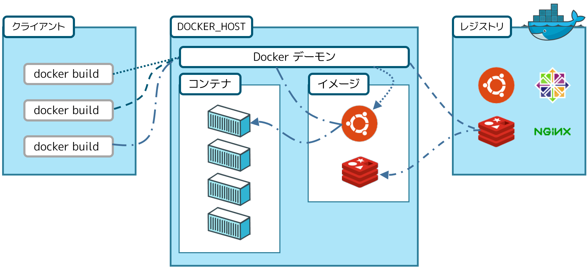

# Docker入門
## Dockerとは
コンテナ型仮想環境を構築、共有、実行するデファクトのOSS。
コンテナとはアプリケーションコードとその依存関係をパッケージ化したデータ構造や仕組みの総称。

## ハードウェア仮想化とコンテナ型仮想化
ハードウェア仮想化では、ホストマシン上でハイパーバイザーを用いて複数の仮想マシン（VM）に分割する仕組みで、OS、CPU、メモリを含むサーバ丸ごと仮想化しているため、必要なマシンリソースが多く、オーバヘッドが大きい。それに対し、コンテナ型仮想化はカーネルのnamespace、cgroupの制御により、プロセスを分離し、アプリケーションとそのライブラリ及び依存関係のみの仮想化をしているため、オーバヘッドが小さく、高速に起動・終了でき、必要なマシンリソースも少ない。


## Dockerを使うメリット
- ホストに左右されず、どんな環境でも動作させられる
- コンテナの構成やアプリケーションの配置定義をコードで管理できる
- サーバリソースの効率化

## Dockerのアーキテクチャ
Dockerはクライアント・サーバ型のアーキテクチャを採用している。
Docker Desktop（Docker for Mac等）でこの構成をまとめてインストールできる。

- Dockerデーモン
イメージ、コンテナ等のDockerオブジェクトの作成・管理を行う。
- Dockerクライアント
ユーザーがDockerとの通信に使うCLI。
- Dockerイメージ
ファイルシステムやアプリケーションの設定をまとめたもので、コンテナ作成のテンプレート、オブジェクト指向でいうクラス。
- Dockerレジストリ
Dockerイメージを格納するレジストリ。Docker HubやAWS ECR。
レジストリの中にリポジトリという階層があり、イメージのバージョン毎に管理している。
- Dockerコンテナ
イメージをもとに作成された実体。オブジェクト指向でいうインスタンス。実行・開始・停止・移動・削除ができる。各コンテナは分離しており干渉しない。コンテナの粒度は基本は1コンテナ1プロセスという考えで良さそうだが、バッチ処理のスケジューラとジョブ分けたりすると複雑になるので絶対条件ではない。1コンテナに1つの関心事のイメージ。

## Dockerfile
Dockerで作成するコンテナイメージを管理するためのファイルでDockerイメージの作成手順、構成情報を記載。
```
# ベースイメージの指定（デフォルトはDocker Hubから取得）
FROM node:14.18
# ホストマシン上のファイルやディレクトリをコンテナ内にコピー
ADD ./frontend /usr/src/app
# ワークディレクトリを設定
WORKDIR /usr/src/app
# イメージビルド時にrm package-lock.jsonとyarn installを実行
RUN rm package-lock.json && yarn install
# イメージビルド時にyarn buildを実行
RUN yarn build
# コンテナ実行時にyarn starを実行
CMD ["yarn", "start"]
```
- COPYとADDの違い
`ADD`リモートからのファイル追加機能と圧縮ファイルの解答機能がついている。
- RUNとCMDの違い
`RUN`はイメージビルド時にDockerコンテナ内で実行するコマンドでアプリケーションの更新や配置で使う。`CMD`はコンテナ実行時にコンテナ内で実行するコマンドでサーバーを立ち上げる等のアプリケーションそのものを動作させる用途で使う。

## Dockerコマンド
- Dockerイメージのビルド
```
docker build -t イメージ名[:タグ名] Dockerfile配置のディレクトリパス
```
※ 一度取得したイメージはホスト内にキャッシュされる。`--pull=true` で強制的に再取得。
- イメージの取得
```
docker pull [options] リポジトリ名[:タグ名]
```
- イメージの一覧
```
docker images [options] リポジトリ名[:タグ名]
```
- イメージの公開
```
docker push [options] リポジトリ名[:タグ名]
```
- コンテナの作成と実行
```
docker run [options] イメージ名[:タグ名] [コマンド] [コマンドの引数]
docker run [options] イメージID[:タグ名] [コマンド] [コマンドの引数]

# ex
docker run -d -p 9000:8000 example:latest
```
- 実行中のコンテナ内でコマンド実行
```
docker exec [options] コンテナIDまたはコンテナ名 コンテナ内で実行するコマンド
```
- コンテナの一覧
```
docker ps [options]
```
- コンテナの停止
```
docker stop コンテナIDまたはコンテナ名
```
- コンテナの破棄
```
docker rm コンテナIDまたはコンテナ名
```
- コンテナのログ取得
```
docker logs [options] コンテナIDまたはコンテナ名
```
-fオプションをつけると、標準出力を取得し続ける。
- dockerの利用していないリソース（コンテナ、イメージ、ボリューム、ネットワーク）の削除
```
docker system prune [options]
```
- 利用状況の取得（ ≒ LinuxのTOPコマンド）
```
docker stats [options] [表示するコンテナID...]
```
- -itオプション
-iはdocker起動後にコンテナ側の標準入力を繋ぎっぱなしにする。-tは擬似端末を有効にする。「-it bash」でコンテナ内でbashを起動する。

2017年1月リリースのv1.13以降、トップレベルコマンド群が増えたことにより、命令体系が再編成されたらしい。
参考
https://qiita.com/zembutsu/items/6e1ad18f0d548ce6c266
https://docs.docker.com/engine/reference/commandline/image/
https://docs.docker.com/engine/reference/commandline/container/
https://docs.docker.jp/engine/reference/commandline/image_toc.html
https://docs.docker.jp/engine/reference/commandline/container_toc.html

## Docker-compose
複数のコンテナを定義し実行する Docker アプリケーションのためのツール。
基本的に開発環境のみで、本番環境では使わない。
コンテナの数が多い場合、depends_onで依存関係が見れるのが良い。
「Dockerfileをbuild → DockerイメージからDockerコンテナを作成」の手順を
```
docker-compose up -d
```
で一括で実行でき、逆に停止と削除を
```
docker-compose down
```
で実行できる。基本的にdockerコマンドと同じコマンドをdocker-composeの後ろにつければ同じことができる。
※ docker-compose互換でDocker Compose CLIがあり、compose-spec準拠でtotoでこっちを推奨。「docker-compose」→「docker compose」で書ける。compose-specとは、プラットフォームに依存しない、マルチコンテナなアプリケーションを定義する標準仕様。

```
version: '2'

services:
  web:
    container_name: "keiba_web"
    build: .
    depends_on:
      - db
      - redis
    volumes:
      - ./:/var/www/html/
      - ./docker-apache-conf/:/etc/apache2/sites-enabled/
    ports:
      - "80:80"
  redis:
    container_name: "keiba_redis"
    image: redis
    ports:
      - "6379:6379"
  db:
    container_name: "keiba_db"
    image: mysql:5.7
    ports:
      - "3306:3306"
    volumes:
      - ../db-data:/var/lib/mysql
      - ./initdb.d:/docker-entrypoint-initdb.d
    environment:
      MYSQL_ROOT_PASSWORD: password
      MYSQL_ALLOW_EMPTY_PASSWORD: "true"
      MYSQL_DATABASE: keiba_contents
      MYSQL_USER: keiba_contents
      MYSQL_PASSWORD: keiba_contents
```
- Services
起動するコンテナの定義。
- build
ビルドするDockerfileのあるディレクトリを指定
- image
ビルドするイメージ名を指定。
- depends_on
サービス同士の依存関係を定義。
- volumes
データ永続化のための機能。
コンテナが削除されてもvolumeを明示的に破棄しない限り、中のデータは保持される。
- ports
ホストマシンとコンテナのポート設定。
ホスト側がkey、コンテナ側がvalue。
- environment
コンテナ内で利用する環境変数の設定。（DB定義等に使う）
ステージング、本番で環境変数を切り替える場合に使う。

## コンテナオーケストレーション
複数コンテナの統合管理のための技術。主な機能としてはオートスケーリング、コンテナのスケジューリング、コンテナの死活監視、障害時の自動復旧等がある。主力なコンテナオーケストレーションプラットフォームはDocker swarmとKurbernetes、Amazon ECS、Amazon EKS。
