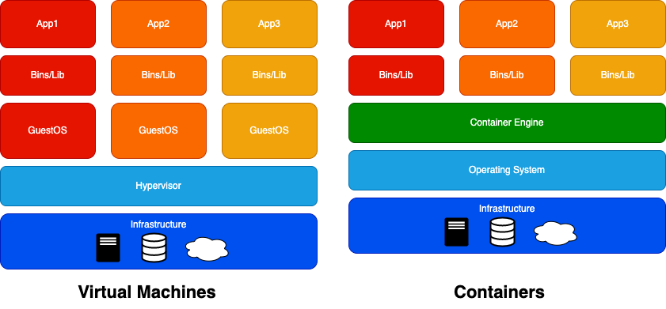

# Dockerとその周辺知識ざっくり説明
## はじめに
今までDockerを雰囲気で使っていた部分があるので、改めて概念や仕組みから、コマンドやツールまでをざっくりまとめました。

## Dockerとは
コンテナ型仮想環境を構築、共有、実行するデファクトのOSSです。
コンテナとはアプリケーションコードとその依存関係をパッケージ化したデータ構造や仕組みの総称のことを指します。

## ハードウェア仮想化とコンテナ型仮想化
Dockerの事前知識として仮想化技術があります。代表的な仮想化技術にはハードウェア仮想化とコンテナ型仮想化があります。
ハードウェア仮想化では、ホストマシン上でハイパーバイザーを用いて複数の仮想マシン（VM）に分割する仕組みで、OS、CPU、メモリを含むサーバ丸ごと仮想化しているため、必要なマシンリソースが多く、オーバヘッドが大きいです。それに対し、コンテナ型仮想化はカーネルのnamespace、cgroupの制御により、プロセスを分離し、アプリケーションとそのライブラリ及び依存関係のみの仮想化をしているため、オーバヘッドが小さく、高速に起動・終了でき、必要なマシンリソースも少ないです。
Dockerは後者のコンテナ型仮想化です。



## Dockerを使うメリット
Dockerを使うことのメリットとして以下が挙げられます。
- ホストに左右されず、どんな環境でも動作させられる
- コンテナの構成やアプリケーションの配置定義をコードで管理できる
- サーバリソースの効率化

## Dockerのアーキテクチャ
Dockerはクライアント・サーバ型のアーキテクチャを採用しています。DockerクライアントはDockerデーモンに処理を依頼し、Dockerデーモンはコンテナの実行、構築、配布を行います。全体像は下図のようなイメージです。（公式より引用）

以下は代表的な用語の説明です。
- Dockerデーモン
イメージ、コンテナ等のDockerオブジェクトの作成・管理を行う。
- Dockerクライアント
ユーザーがDockerとの通信に使うCLI。
- Dockerイメージ
ファイルシステムやアプリケーションの設定をまとめたもので、コンテナ作成のテンプレート、オブジェクト指向でいうクラス。
- Dockerレジストリ
Dockerイメージを格納するレジストリ。Docker HubやAWS ECR。
レジストリの中にリポジトリという階層があり、イメージのバージョン毎に管理している。
- Dockerコンテナ
イメージをもとに作成された実体。オブジェクト指向でいうインスタンス。実行・開始・停止・移動・削除ができる。各コンテナは分離しており干渉しない。コンテナの粒度は基本は1コンテナ1プロセスという考えで良さそうだが、バッチ処理のスケジューラとジョブ分けたりすると複雑になるので絶対条件ではない。1コンテナに1つの関心事のイメージ。
- Docker Desktop（Docker for Mac等）
Dockerデーモン、Dockerクライアント、Docker Compose等をまとめてインストールできる。

## Dockerfile
Dockerで作成するコンテナイメージを管理するためのファイルでDockerイメージの作成手順、構成情報を記載します。
以下はホストマシンのfrontendディレクトに配置したnodeベースのアプリケーションをビルドするDockerfileです。
```
# ベースイメージの指定（デフォルトはDocker Hubから取得）
FROM node:14.18
# ホストマシン上のファイルやディレクトリをコンテナ内にコピー
CMD ./frontend /usr/src/app
# ワークディレクトリを設定
WORKDIR /usr/src/app
# イメージビルド時にrm package-lock.jsonとyarn installを実行
RUN rm package-lock.json && yarn install
# イメージビルド時にyarn buildを実行
RUN yarn build
# コンテナ実行時にyarn starを実行
CMD ["yarn", "start"]
```
COPYとADD、RUNとCMDは似ていますが、以下の違いがあります。
- COPYとADDの違い
`ADD`はリモートからのファイル追加機能と圧縮ファイルの解凍機能がついており、基本的には`COPY`コマンドを使うことが多いです。
- RUNとCMDの違い
`RUN`はイメージビルド時にDockerコンテナ内で実行するコマンドでアプリケーションの更新や配置で使う。`CMD`はコンテナ実行時にコンテナ内で実行するコマンドでサーバーを立ち上げる等のアプリケーションそのものを動作させる用途で使います。

## Dockerコマンド
Dockerを使う上でよく使うコマンドを記載します。
2017年1月18日にリリースされた Docker v1.13 以降（今日現在の v17.03.0-ce ）はコマンドラインの命令体系が再編成されましたが、現状、旧コマンドでも動くのと、コマンドが短く使いやすいため、旧コマンドも合わせて記載します。

- Dockerイメージのビルド
```
docker build -t イメージ名[:タグ名] Dockerfile配置のディレクトリパス
```
※ 一度取得したイメージはホスト内にキャッシュされます。`--pull=true` で強制的に再取得します。
- イメージの取得
```
docker image pull [options] リポジトリ名[:タグ名]
// 旧コマンド
docker pull [options] リポジトリ名[:タグ名]
```
- イメージの一覧
```
docker image ls [options] リポジトリ名[:タグ名]
// 旧コマンド
docker images [options] リポジトリ名[:タグ名]
```
- イメージの公開
```
docker image push [options] リポジトリ名[:タグ名]
// 旧コマンド
docker push [options] リポジトリ名[:タグ名]
```
- コンテナの作成と実行
```
docker container run [options] イメージ名[:タグ名] [コマンド] [コマンドの引数]
docker container run [options] イメージID[:タグ名] [コマンド] [コマンドの引数]
// 旧コマンド
docker run [options] イメージ名[:タグ名] [コマンド] [コマンドの引数]
docker run [options] イメージID[:タグ名] [コマンド] [コマンドの引数]

// ex
docker container run -d -p 9000:8000 example:latest
```
- 実行中のコンテナ内でコマンド実行
```
docker container exec [options] コンテナIDまたはコンテナ名 コンテナ内で実行するコマンド
// 旧コマンド
docker exec [options] コンテナIDまたはコンテナ名 コンテナ内で実行するコマンド
```
- コンテナの一覧表示
```
docker container ls [options]
// 旧コマンド
docker ps [options]
```
- コンテナの停止
```
docker container stop コンテナIDまたはコンテナ名
// 旧コマンド
docker stop コンテナIDまたはコンテナ名
```
- コンテナの破棄
```
docker container rm コンテナIDまたはコンテナ名
// 旧コマンド
docker rm コンテナIDまたはコンテナ名
```
- コンテナのログ取得
```
docker container logs [options] コンテナIDまたはコンテナ名
// 旧コマンド
docker logs [options] コンテナIDまたはコンテナ名
```
-fオプションをつけると、標準出力を取得し続けます。
- dockerの利用していないリソース（コンテナ、イメージ、ボリューム、ネットワーク）の削除
```
docker system prune [options]
```
- 利用状況の取得（ ≒ LinuxのTOPコマンド）
```
docker stats [options] [表示するコンテナID...]
```
- -itオプション
-iはdocker起動後にコンテナ側の標準入力を繋ぎっぱなしにする。-tは擬似端末を有効にする。「-it bash」でコンテナ内でbashを起動します。

## Docker-compose
複数のコンテナを定義し実行する Docker アプリケーションのためのツールです。
基本的に開発環境のみで、本番環境ではあまり使いません。
コンテナの数が多い場合、depends_onで依存関係が見れます。
「Dockerfileをbuild → DockerイメージからDockerコンテナを作成」の手順を
```
docker-compose up -d
```
で一括で実行でき、逆に停止と削除を
```
docker-compose down
```
で実行できます。基本的にdockerコマンドと同じコマンドをdocker-composeの後ろにつければ同じことができます。
※ docker-compose互換でcompose-spec準拠のDocker Compose CLIがあり、「docker-compose」→「docker compose」で書けます。compose-specとは、プラットフォームに依存しない、マルチコンテナなアプリケーションを定義する標準仕様です。

```
version: '2'

services:
  web:
    container_name: "sample_web"
    build: .
    depends_on:
      - db
      - redis
    volumes:
      - ./:/var/www/html/
      - ./docker-apache-conf/:/etc/apache2/sites-enabled/
    ports:
      - "80:80"
  redis:
    container_name: "sample_redis"
    image: redis
    ports:
      - "6379:6379"
  db:
    container_name: "sample_db"
    image: mysql:5.7
    ports:
      - "3306:3306"
    volumes:
      - ../db-data:/var/lib/mysql
      - ./initdb.d:/docker-entrypoint-initdb.d
    environment:
      MYSQL_ROOT_PASSWORD: password
      MYSQL_ALLOW_EMPTY_PASSWORD: "true"
      MYSQL_DATABASE: sample_database
      MYSQL_USER: sample_user
      MYSQL_PASSWORD: password
```
- Services
起動するコンテナの定義。
- build
ビルドするDockerfileのあるディレクトリを指定
- image
ビルドするイメージ名を指定。
- depends_on
サービス同士の依存関係を定義。
- volumes
データ永続化のための機能。
コンテナが削除されてもvolumeを明示的に破棄しない限り、中のデータは保持される。
- ports
ホストマシンとコンテナのポート設定。
ホスト側がkey、コンテナ側がvalue。
- environment
コンテナ内で利用する環境変数の設定。（DB定義等に使う）
ステージング、本番で環境変数を切り替える場合に使う。

## コンテナオーケストレーション
docker-composeは基本的に1つのホストマシンで複数コンテナを管理するツールですが、複数ホストで複数コンテナを統合管理するためにはコンテナオーケストレーションという技術を使います。主な機能としてはオートスケーリング、コンテナのスケジューリング、コンテナの死活監視、障害時の自動復旧等があります。主力なコンテナオーケストレーションプラットフォームはDocker swarmやKurbernetesがあり、クラウドのマネージドサービスでAmazon ECS、Amazon EKS、Google Kubernetes Engine(GKE)等があります。

## 最後に
Dockerはコマンドを覚えていけば最低限使うことができますが、
それだけではエラー発生時に対処できないので、周辺知識や仕組みを知ることは大事です。
また、kubernates等のコンテナ技術をベースとした発展的な技術が出てきているので、今後は使えるだけでなく、本質的な理解が必須となってくると思います。